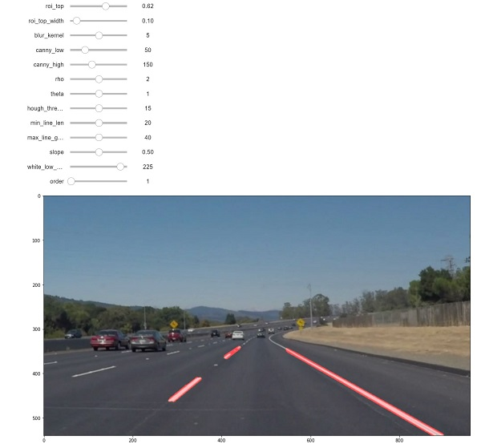
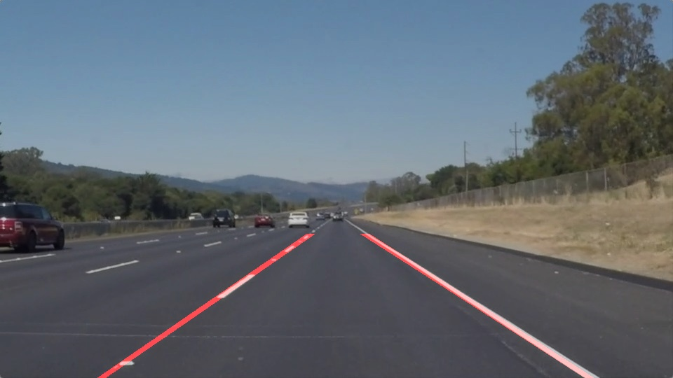
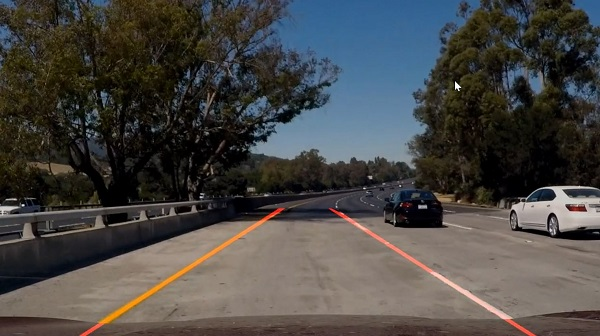

# **Finding Lane Lines on the Road** 

### Project scope

The goals / steps of this project are the following:
* Make a pipeline that finds lane lines on the road
* Reflect on your work in a written report

---
### Reflection

#### 1. Pipeline

My original pipeline consisted of the following steps (for each individual image):
 * first I convert the image to grayscale
 * add some blurring to reduce some of the noise
 * apply the Canny algorithm to find edges in the image
 * since there are a lot of other objects (shapes, edges) on the road, 
   we filter out everything outside our region of interest 
   (where the road and lines usually are in the image)
 * we then apply the Hough algorithm to extract the lines from the edges just found
 * any lines found are then drawn on top of the original image

Still, to get to proper results, I had to fine-tune a lot of parameters for each of the steps mentioned above,
like the size of the blurring kernel, parameters for the Canny and Hough algorithms, etc.

So I have parametrized my `find_lanes` function implementing the pipeline, and used a [Jupyter notebook extension](https://ipywidgets.readthedocs.io/en/latest/examples/Widget%20List.html),
to search for the best combination of parameters while getting live feedback:

The first challenge was now to identify the left and right lines defining our current lane.
So, I modified the `draw_lines()` function to:
 * compute the *slope* of each line
 * split the lines in two clusters: positive slope in one cluster, negative in another
 * average lines in each cluster
 * draw the two new averaged lines

This solved the basic requirements of the project, by obtaining a decent enough aproximation of the two lane lines:

The project also has an optional challenge, on which the pipeline described above failed miserably.
So a few adjustments were needed:
* change the field of view to be defined not in absolute pixels, but relative to the image shape.
  This way, the pipeline is more robust to images of different resolutions.
* the final video contains a lot of shadows and irregularities in the color or the asphalt.
  One fix was to add color filtering before grayscaling, to only allow nuances of white and yellow (the color of the lines)
* Still, there were a lot of other unwanted lines, mostly perpendicular to our direction of travel.
  Given that from our perspective the lane line are always having similar slopes, 
  I did some pre-filtering based on the `slope` of the line being in some measured ranges (ex: *0=horizontal*, *1=45degrees*) 
* finally, I replaced averaging the lines in a cluster with fitting a curve 
  to best describe all of the points on the edges of the detected lines, giving me a 1st order polynomial (aka a straight line)

With sufficient tuning all the steps above provided a decent solution for the challenge video as well:

#### 2. Shortcomings

Some of the shortcomings of the approach described above are:
 * it is very fine-tuned for a couple of images, so most likely some of the parameters would need recalibrating for:
    * different weather and lighting conditions
    * different road types, with other colors for the road and lines
    * different cameras and setups
 * since it always approximates straight lines, it is not very accurate on curved roads
 * the lines are computed in camera space, but to be really useful they would need to be in world/ego space

#### 3. Possible improvements

By trying to address the issues above, several improvements are possible:
 * use a more adaptive approach to color filtering, exposure compensation, etc. 
 * use a neural network to detect the line, as it could be more robust to variations in shape, color and position, 
   if trained on varied enough examples
 * approximate the lines with a higher order polynomial. In theory it should be more accurate in describing the lines, 
   but in practice I did not get better results than the straight line
 * if camera parameters are known, one could transform the lines from image space to ego space
 * the execution time could be greatly improved by working more with vectorized numpy data, or by switching to c++    