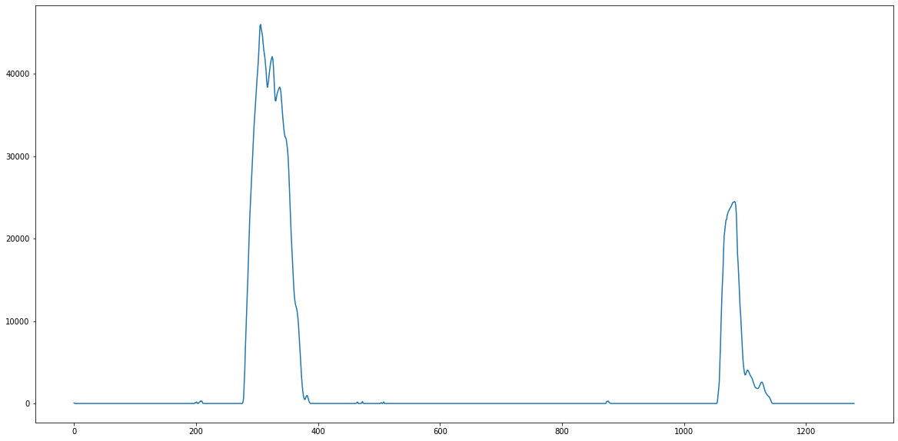

# Advanced Lane Finding

## Project scope

The goals / steps of this project are the following:

* Compute the camera calibration matrix and distortion coefficients given a set of chessboard images.
* Apply a distortion correction to raw images.
* Use color transforms, gradients, etc., to create a thresholded binary image.
* Apply a perspective transform to rectify binary image ("birds-eye view").
* Detect lane pixels and fit to find the lane boundary.
* Determine the curvature of the lane and vehicle position with respect to center.
* Warp the detected lane boundaries back onto the original image.
* Output visual display of the lane boundaries and numerical estimation of lane curvature and vehicle position.

---
## Reflection
The entire project was developed in [this notebook](P2.ipynb). The steps are described below:

### 1. Camera calibration
The camera usually adds some distortions so if we want to detect correct lines and curvatures,
we need to remove these distortions. Since we are already provided with a set of images of chessboards
taken with the same camera we will use further in the project, we can use the to compute the camera parameters.

For this, we use opencv to find the corners of the chessboard squares 
and from those to deduce the camera matrix and distortion coefficients

|Original | Calibration|
|---------|------------|
|| |

### 2. Perspective transformation
In a normal image, objects that are further away appear smaller, and closer, so to have an accurate line detection
we would need to change our perspective to a top-view one. This can be achieved by finding an abject whose shape we recognize
and we make sure that still remains consistent after the perspective transformation.

In this case I took a lane on a straight road, which looks like an isosceles trapezoid and made sure 
that in the target image it would look like a rectangle. I used a Jupyter widget to visually fine-tune the two shapes
and then used them to compute the perspective transformation matrix and its inverse.

### 3. Color filtering
This was perhaps the trickiest part of the project and a lot of the time was spent here.
Getting proper line detection using color filtering is tricky as you need to account for many corner cases like:
over/under exposure, different types of asphalt, shadows and reflections, etc.

After many experiments, I have decided to have my keep my color filter relatively simple, consisting of:
* convert to [HLS](https://en.wikipedia.org/wiki/HSL_and_HSV) color space and use the **L** (Lightness) 
  and **S** (Saturation) channels 
* use the **L** channel to compute a [Sobel](https://en.wikipedia.org/wiki/Sobel_operator) gradient along the `x` axis.
  This would accentuate lines away from horizontal (as most lines on the road are appear close to vertical)
* the **S** channel is used as is, as I found it to be a good indicator of where lines are
* convert to **HSV** color space and use to better filter out the *white* and *yellow* colors in the image

For all these channels I applied some filters and only kept values in specific ranges, 
to keep only the relevant features/colors. The filters were again found by visually finetunning the values in a notebook.

|Filter|Image|
|------|-----|
|Original||
|L Channel||
|Sobel on X||
|S Channel||
|Filtered S Channel||
|Yellow filter||  
|White filter||
|Final filter||

### 4. Single image pipeline
Now that we have the filtered binary image containing white pixels where the lines should be, we need to find our lane,
by approximating the left and right lines. The pipeline goes like this:
* un-distort the image
* apply the color filter
* change perspective
* find the pixels describing the left and write lines
* approximate them by fitting a quadratic polynomial
* use the polynomials to compute the radius of the curvature of the road
* approximate where we are relative to the center of the lane
* draw the lane back on top of the un-warped image, along with the information computed above

To find the lines in the warped binary image, we first use a histogram to see where on the x axis we have the most white pixels.
This should indicate the left and light lines. 

|Original|Warped|Warped binary|Histogram|
|--------|------|-------------|---------|
|||||

We start from there (bottom of the image) and go up using a search window to find the continuation of the lines.
Once we finish, we fit a quadratic polynomial through the center points of the search windows.

|Warped binary|Fitted lines|
|-------------|------------|
|||

For computing the radius of the curvature we simply follow [the formula](https://www.intmath.com/applications-differentiation/8-radius-curvature.php)
for the quadratic polynomial and print the average for the two lines. 

As per recommendation, we do the conversion to meters,
to make sure we have a correct implementation (for the project video the target is ~1km).
We do this by simply converting pixels to meters, given that in our warped image the width and length of the lane 
(3.7m, 30m) measure about (780px, 700px)

Once we project the lines back to the original (un-w  arped) image, we get a result like this:

### 5. Video processing
The existing approach proved to be enough for the project video, but when trying the challenge, 
there were situations where the lines were not detected, especially under the bridge, 
where the low light made the lines almost invisible.

To solve this, I simply kept a short history of the last detections, and when I have an invalid detection 
I simply use a value from history. This value is actually an average of the last valid detections, to smooth out
big jumps in consecutive detections.

To classify a detection as invalid I simply check that the curvature is in a range that can be encountered on a highway,
that the two lines are somewhat parallel and at a normal distance to one another.

Another suggestion that I implemented was to keep the previous detection (the fitted polynomial) and only search
in the area close to the old detection. While this could prove crucial in some corner cases, 
I haven't seen much improvement in the accuracy of the pipeline after adding this feature.

The end result of the video pipeline looks like this: (you can find the full videos [here](output_videos/))

## Discussion
While most of the issues in the challenge video have been addressed, there are still some improvements possible.
The *harder_challenge* video on the other hand proved quite difficult. The pipeline is not robust enough yet 
to handle the forrest shadows, short field of view, the steep curves or even the lanes going out of sight.

The pipeline can be further improved by adding more checks to validate lanes and lines, 
to have a dynamic field of view of to better handle searching near the edges of the image.

Sill, I think the weakest point of the pipeline is still the image filtering, as it does not cover properly all the edge cases.
Of course more fine-tuning can be done, or even exploiting other color spaces like **LAB** could help,
but in the end the most reliable improvement to the project would be to replace the image color filtering 
with an image segmentation neural network for detecting line pixels. 
