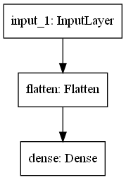
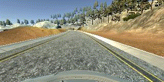
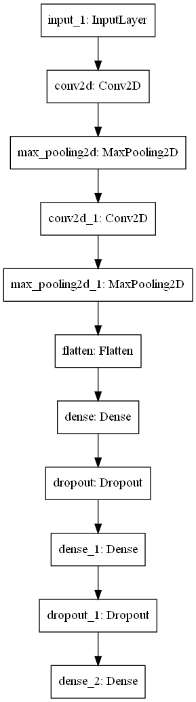

# **Behavioral Cloning**

## Project scope
The goals of the project are as follows:
* Use the simulator to collect data of good driving behavior
* Build, a convolution neural network in Keras that predicts steering angles from images
* Train and validate the model with a training and validation set
* Test that the model successfully drives around track one without leaving the road
* Summarize the results with a written report

## Writeup / README

### Data collection
I used the [provided simulator](https://github.com/udacity/self-driving-car-sim) which is a standalone application
based on Unity, created specifically for this project.

For data collection I used initially intended to use a PS4 controller instead of keyboard or mouse, 
as it is easier to drive the car around, and it should provide more accurate (smoother changes in) values 
for the steering command used further in the project. As a result, I used ( `Term 1 - Version 1, 12/09/16` ) 
as the latest one does not support the PS4 controller.

Later I found that version 1 has some issues with recording the data, so I switched back to the latest released version 
(`Term 1 - Version 2, 2/07/17`), as I was not interested in re-compiling the simulator from the source code. 
Mouse and keyboard will have to do.

All data is stored locally in the `data` folder, but it is not pushed in this repository.
For details on how the dataset is prepared, have a look at [dataset.py](dataset.py)

### Setup
As I wanted to use up-to-date libraries (like tensorflow and keras) I am using my own [requirements.txt](requirements.txt)
instead of the suggested conda environment. Either way, as the simulator hasn't been updated in a while, 
I had to use older versions for some libraries (like `python-socketio` and `python-engineio`) to restore the communication
between python scripts and the simulator.

Other changes to the provided code included:
  * fix [keras version check](drive.py) to be compatible with latest keras version inside tensorflow
  * change the [video generation](video.py) to support .gif format, to be able to include examples in this writeup 

### Pipeline
All the training code is stored in the [train.py](train.py) script.

#### Experiments
I wanted to start with a simple model, to make sure the pipeline is correct. I used a `Flatten` layer
followed by a `Dense(1)` as suggested in the course. Since the data consists of only center images form the (mostly circular) first track, 
this made the network over-steer a lot:

|Dataset|Model|Output|
|-------|-----|------|
| 1364 |  |  |

An obvious fix is to flip all images to prevent the network favoring a specific direction (left/right)

|Dataset|Model|Output|
|-------|-----|------|
| 2728 |  |  |

This looks more balanced, so the next step is to improve the model a bit. 
First stop is the simple [LeNet](http://yann.lecun.com/exdb/lenet/) architecture.

|Dataset|Model|Output|
|-------|-----|------|
| 2728 |  |  |

The loss was a lot lower after just 5 epochs, and it shows that the steering is a bit smoother, 
but once the car leaves the middle of the road, it gets confused, as it hasn't seen much data from the side of the road.
One suggestion from the course was to add the left and right images, with a correction applied to the steering wheel
```python
delta_steering = 0.2

images.append(left_img)
labels.append(label + delta_steering)
```

|Dataset|Model|Output|
|-------|-----|------|
| 8184 | LeNet (as before) |  |


