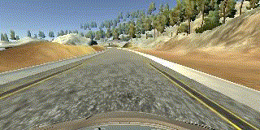
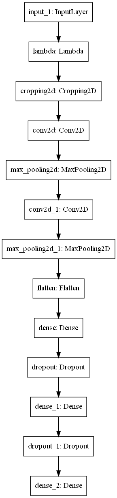
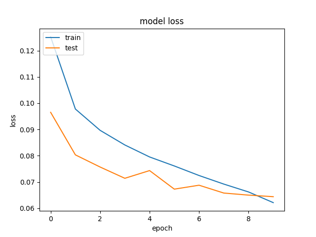
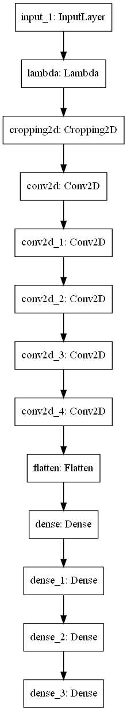
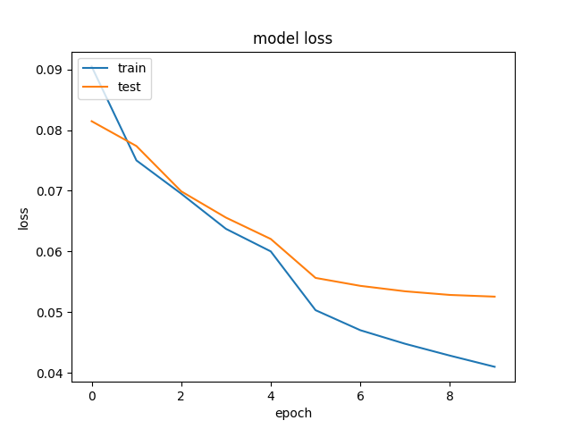

# **Behavioral Cloning**

## Project scope
The goals of the project are as follows:
* Use the simulator to collect data of good driving behavior
* Build, a convolution neural network in Keras that predicts steering angles from images
* Train and validate the model with a training and validation set
* Test that the model successfully drives around track one without leaving the road
* Summarize the results with a written report

## Writeup / README

### Data collection
I used the [provided simulator](https://github.com/udacity/self-driving-car-sim) which is a standalone application
based on Unity, created specifically for this project.

For data collection I initially intended to use a PS4 controller instead of keyboard or mouse, 
as it is easier to drive the car around, and it should provide more accurate (smoother changes in) values 
for the steering command used further in the project. As a result, I used ( `Term 1 - Version 1, 12/09/16` ) 
as the latest one does not support the PS4 controller.

Later I found that version 1 has some issues with recording the data, so I switched back to the latest released version 
(`Term 1 - Version 2, 2/07/17`), as I was not interested in re-compiling the simulator from the source code. 
Mouse and keyboard will have to do.

All data is stored locally in the `data` folder, but it is not pushed in this repository.
For details on how the dataset is prepared, have a look at [dataset.py](dataset.py)

### Setup
As I wanted to use up-to-date libraries (like tensorflow and keras) I am using my own [requirements.txt](requirements.txt)
instead of the suggested conda environment. Either way, as the simulator hasn't been updated in a while, 
I had to use older versions for some libraries (like `python-socketio` and `python-engineio`) to restore the communication
between python scripts and the simulator.

Other changes to the provided code included:
  * fix [keras version check](drive.py) to be compatible with latest keras version inside tensorflow
  * change the [video generation](video.py) to support .gif format, to be able to include examples in this writeup 

### Pipeline
All the training code is stored in the [train.py](train.py) script.

#### Experiments
I wanted to start with a simple model, to make sure the pipeline is correct. I used a `Flatten` layer
followed by a `Dense(1)` as suggested in the course. Since the data consists of only center images form the (mostly circular) first track, 
this made the network over-steer a lot:

|Dataset|Model|Output|
|-------|-----|------|
| 1364 |  |  |

An obvious fix is to flip all images to prevent the network favoring a specific direction (left/right)

|Dataset|Model|Output|
|-------|-----|------|
| 2728 |  |  |

This looks more balanced, so the next step is to improve the model a bit. 
First stop is the simple [LeNet](http://yann.lecun.com/exdb/lenet/) architecture.

|Dataset|Model|Output|
|-------|-----|------|
| 2728 |  |  |

The loss was a lot lower after just 5 epochs, and it shows that the steering is a bit smoother, 
but once the car leaves the middle of the road, it gets confused, as it hasn't seen much data from the side of the road.
One suggestion from the course was to add the left and right images, with a correction applied to the steering wheel
```python
delta_steering = 0.2

images.append(left_img)
labels.append(label + delta_steering)
```

|Dataset|Model|Output|
|-------|-----|------|
| 8184 | LeNet (as before) |  |

I have gathered one more lap of data, but the network did not improve, so I started to debug the pipeline.

I switched to the provided training data, and only used the central image to make sure I don't have a bug in my data gathering code.
Sure enough, I was training the model with images loaded `cv2.imread` in BGR format, 
while during the drive they were given in RGB format. After the conversion to RGB, and a simple normalization of the images
(`img / 255.0 - 0.5`) we were back on track ( :drum: ). While a lot more stable, it missed the first curve after the bridge.

|Dataset|Model|Output|
|-------|-----|------|
| 8036 | Normalization + LeNet|  |

Adding back the left and right images, and their flipped versions improved the model. 
On top of that, cropping out the top (sky, trees) and bottom (car hood) with `Cropping2D(cropping=((70, 25), (0, 0)))` 
helped the model to complete the first track:

|Dataset|Model|Output|
|-------|-----|------|
| 48216 | Normalization + Crop + LeNet|  |

At this point the model is specialized on the first track, so I recreated the dataset to include for each of the two tracks two laps
(one in each direction) plus some examples of recovering from edges of the road. This was enough for the model to
successfully complete both tracks, even at higher speeds.

|Dataset|Model|Output|
|-------|-----|------|
| 50700 | Normalization + Crop + LeNet|  |

I am quite happy with the results, but I noticed that by training on low quality data, the model doesn't perform
as good when tested on higher quality rendered images. My guess is that it gets confused by the tree shadows on the road
that appear only on higher quality images. This also means that the network does not generalize as good as I thought.

### Final model
First fix was to re-record the dataset in higher quality, and to explore the smaller [PilotNet](https://arxiv.org/pdf/1704.07911.pdf) model from Nvidia.
This new model also completed both tracks, but it reaches a lower mean squared error on the validation set 
while being almost 6 times smaller (348,219 vs 1,935,161 parameters)

|LeNet| |PilotNet| |
|---|---|-----|----|
|Architecture|Loss|Architecture|Loss|
|||||

Here is a more detailed look into the final architecture and layer shapes:
```
_________________________________________________________________
Layer (type)                 Output Shape              Param #   
=================================================================
input_1 (InputLayer)         [(None, 160, 320, 3)]     0         
_________________________________________________________________
lambda (Lambda)              (None, 160, 320, 3)       0         
_________________________________________________________________
cropping2d (Cropping2D)      (None, 65, 320, 3)        0         
_________________________________________________________________
conv2d (Conv2D)              (None, 31, 158, 24)       1824      
_________________________________________________________________
conv2d_1 (Conv2D)            (None, 14, 77, 36)        21636     
_________________________________________________________________
conv2d_2 (Conv2D)            (None, 5, 37, 48)         43248     
_________________________________________________________________
conv2d_3 (Conv2D)            (None, 3, 35, 64)         27712     
_________________________________________________________________
conv2d_4 (Conv2D)            (None, 1, 33, 64)         36928     
_________________________________________________________________
flatten (Flatten)            (None, 2112)              0         
_________________________________________________________________
dense (Dense)                (None, 100)               211300    
_________________________________________________________________
dense_1 (Dense)              (None, 50)                5050      
_________________________________________________________________
dense_2 (Dense)              (None, 10)                510       
_________________________________________________________________
dense_3 (Dense)              (None, 1)                 11        
=================================================================
Total params: 348,219
Trainable params: 348,219
Non-trainable params: 0
_________________________________________________________________
```

The model was trained on 80 % of the mentioned dataset for `10 epochs` while the rest of 20 % was used for validation. 
As it was a regression task the loss function used was *mean squared error* with `Adam` as optimizer. For the `learning rate`
a very simple schedule was used: 1e-3 for the first 5 epochs, and then 1e-4 for the final 5.


### Conclusion

The best part of the project was testing the model. During the autonomous driving in the simulation, 
I would take control, steer the car to the edge of the road and watch it recover back to the middle of the road.


One limitation of the solution is that at higher speeds you can notice a slight zig-zag on straight sections of the road.
Also, since in this setup we do not control the throttle, if the target speed is too high ( > 20 ), the car goes off
the road in tight curves, especially on the second track.

For a better demo of the final results, you can have a look at this [video](video.mp4).

If I were to continue improving this project, I would:
* play some more with learning rate scheduling
* use more data augmentation 
    * adjust the brightness to account for areas with large shadows
* test other model architectures (like VGG), and experiment with using pre-trained weights
* feed last `n` frames to the network merged into a single image os size `(n*160, 320, 3)` to get a smoother trajectory
* feed last `n` frames into an LSTM network
* experiment with reinforcement learning

