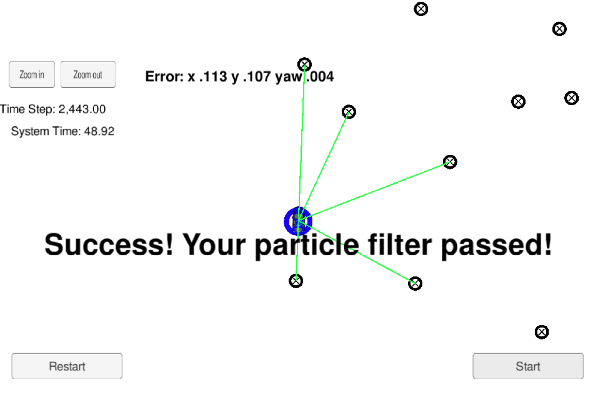

# **Kidnapped Vehicle**

## Project scope
The goals of the project are as follows:
* Utilize a 2 dimensional particle filter to localize a moving vehicle on a given map.
* Passing the project requires obtaining an error for the x, y, theta lower than a certain threshold expected by the grading script
* Data provided live by a simulator

## Writeup / README
This project involves the Term 2 Simulator which can be downloaded [here](https://github.com/udacity/self-driving-car-sim/releases).

This repository includes a [script](install-ubuntu.sh) that can be used to set up and install [uWebSocketIO](https://github.com/uWebSockets/uWebSockets). 

Once the install for uWebSocketIO is complete, the main program can be built and run by doing the following from the project top directory.

```
./clean.sh
./build.sh
./run.sh
```
Most of this project's code was already provided, with a lot of TODO's in [particle_filter.cpp](src/particle_filter.cpp).
My contribution was mostly replacing those TODOs with the code developed throughout the course and marking them as DONE to keep track of the status.

Some of things I had to pay attention to were:
* correct handling of the prediction model for very small yaw rates
* use of `auto& item: items` inside for loops instead of the classical `int i=0; ...` approach
* make sure to correctly convert from one frame of reference to another (ego to map)



## Other remarks
Here is the main protocol that main.cpp uses for uWebSocketIO in communicating with the simulator.

INPUT: values provided by the simulator to the c++ program

// sense noisy position data from the simulator

["sense_x"]

["sense_y"]

["sense_theta"]

// get the previous velocity and yaw rate to predict the particle's transitioned state

["previous_velocity"]

["previous_yawrate"]

// receive noisy observation data from the simulator, in a respective list of x/y values

["sense_observations_x"]

["sense_observations_y"]


OUTPUT: values provided by the c++ program to the simulator

// best particle values used for calculating the error evaluation

["best_particle_x"]

["best_particle_y"]

["best_particle_theta"]

//Optional message data used for debugging particle's sensing and associations

// for respective (x,y) sensed positions ID label

["best_particle_associations"]

// for respective (x,y) sensed positions

["best_particle_sense_x"] <= list of sensed x positions

["best_particle_sense_y"] <= list of sensed y positions


#### The Map*
`map_data.txt` includes the position of landmarks (in meters) on an arbitrary Cartesian coordinate system. Each row has three columns
1. x position
2. y position
3. landmark id

### All other data the simulator provides, such as observations and controls.

> * Map data provided by 3D Mapping Solutions GmbH.