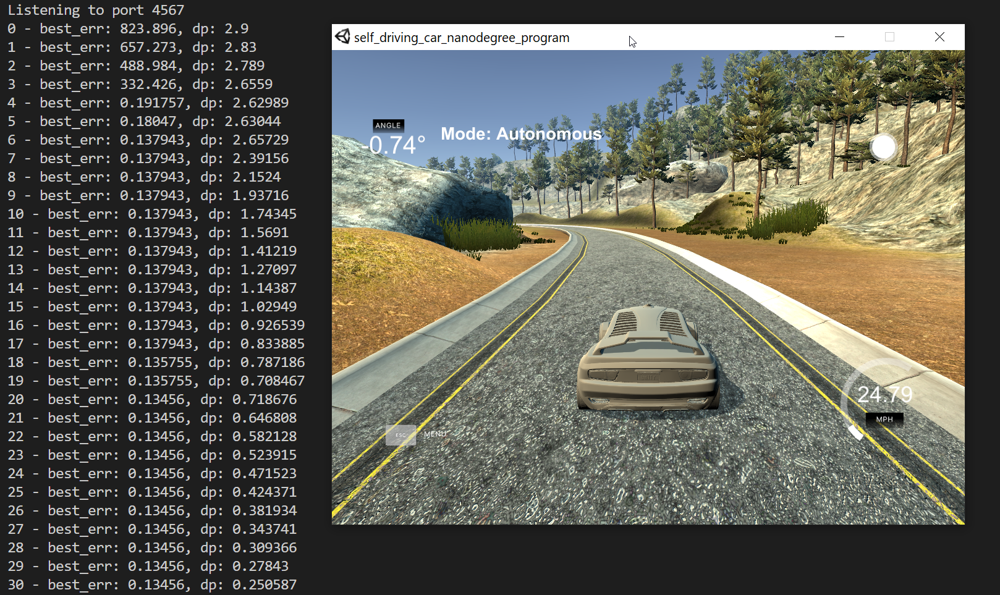

# **PID Control**
Self-Driving Car Engineer Nanodegree Program
   
## Project scope
The goal for this project is to implement a proportional–integral–derivative controller to safely navigate around a virtual track. We are provided the car's cross track error, which is the distance from the car to the middle of the lane. Using a calibrated PID, the car should be able to complete a lap around the track, by following the middle of the road.

For more details on the setup and constraints, see the [original instructions](instructions.md)


## Writeup / README
The implementation of the [PID Controller](src/PID.cpp) is quite straight-forward and follows the instructions in the lectures.

It consists of three main components:
* Proportional - it influences the response proportionally to the current error (cross track error).
* Integral - the controller is reponding to the historic cumulative value of the error. Once compensated for, the error should stop increasing, hence the control impact will not increase.
* Derivative - is estimates the future trend of the error and tries to compensate the control accordingly.

The values chosen for the PID controller are `0.477, 0.0, 4.31`. This means that:
* a small (`0.477`) control is proportional to the error, that means a corrective control is always applied in response to the size of the error (how off-track we are)
* no (`0`) influence from the integral part: since the simulation is perfect, and the track is circular, there is no hidden bias (drift) in the simulated car, that the controller needs to compensate for
* a large (`4.31`) derivative influence means the controller is good at anticicpating the trend of the error and can compensate accordingly


### Calibration
The assignement suggested several approaches for figuring out the best parameters for the PID controller like random search, gradient descent, etc. I decided to go with the simple *twiddle* algorithm proposed in the lecture:

```python
def twiddle(tol=0.2): 
    p = [0, 0, 0]
    dp = [1, 1, 1]
    robot = make_robot()
    x_trajectory, y_trajectory, best_err = run(robot, p)

    it = 0
    while sum(dp) > tol:
        print("Iteration {}, best error = {}".format(it, best_err))
        for i in range(len(p)):
            p[i] += dp[i]
            robot = make_robot()
            x_trajectory, y_trajectory, err = run(robot, p)

            if err < best_err:
                best_err = err
                dp[i] *= 1.1
            else:
                p[i] -= 2 * dp[i]
                robot = make_robot()
                x_trajectory, y_trajectory, err = run(robot, p)

                if err < best_err:
                    best_err = err
                    dp[i] *= 1.1
                else:
                    p[i] += dp[i]
                    dp[i] *= 0.9
        it += 1
    return p
```

The biggest challenge to adapting the [twiddle agorithm](src/twiddle.cpp) was to split it in order to accomodate the "event-based" nature of the simulator. The simulator is an independent application separate from your own. You can only communicate with it through web sockets: you send control data through a socket, and you receive the error through a socket(a callback). The downside is that you cannot simply run the simulation for a couple of seconds inside a while loop, stop it and start again, but instead you need to implement your logic through events using a state machine.

This means we need to split the twiddle algorithm in three states, which correspond to instructions right after the parameter evaluation `run(robot, p)`
```C++
class Twiddle {
    enum State {
        INIT,
		FIRST_CHECK,
		SECOND_CHECK
	};
```
We run the simulation with a given configuration of PID parameters (until a maximum number of steps is executed, we go off road, or get stuck)
```C++
if (frame >= MAX_FRAMES || (frame > 10 && std::abs(cte) > 6) || (frame > 100 && speed < 1)) {
    if (!twiddle.IsDone()) {
        ...
    }
}
```
We compute an error relevant to how bad the controller performed using this confguration, ex: how far did it go, and what was the average cross track error
```C++
double err = MAX_FRAMES - frame + total_cte/frame;
```
This error is then used to guide the next step in the twiddle logic, depending on the current state: increase/decrease the current parameter, or increase/decrease the search space for it
```C++
if (err < best_err) {
    best_err = err;
    dp[idx] *= 1.1;
} else {
    p[idx] += dp[idx];
    dp[idx] *= 0.9;
}
```
Intializing the twiddle algorithm with `0.0, 0.0, 0.0` for the parameters and `1.0, 1.0, 1.0` for the search space, we can leave it running for ~20 minutes (until the sum of `dp` is below 0.2: smaller is better, so a good indicative of the confidence in the found solution).



For this, I created a new [calibration](src/calibrate.cpp) target, which found a solution for `0.477, 0.0, 4.31`. These values I then hard-coded in the [main](src/calibrate.cpp#L40) script and managed to complete a full round-trip on the track.

For the throttle, I decided that instead of continuously accelerating, to try [another PID controller](src/main.cpp#L43) which would keep a constant 25 MPH speed. Since I am not interested in the accuracy of the longitudinal control that much, a simple `1, 0, 0` seemed to do the job.

### Possible improvements
Implementing the PID itself was a very simple task, most effort being spent in making the twiddle algorithm work with the simulation. So if I were to improve on something it would be the calibration part. Probably there are other search/optimization algorithms that are more suited to calibrating a PID in the context of this simulator. The most interesting approach for we would be to try a simple reinforcement algorithm.

Other improvements would probably mean implementing more advanced controlers like [Model Predictive Control (MPC)](https://en.wikipedia.org/wiki/Model_predictive_control) or [Stanley Controller](https://www.mathworks.com/help/driving/ref/lateralcontrollerstanley.html)
