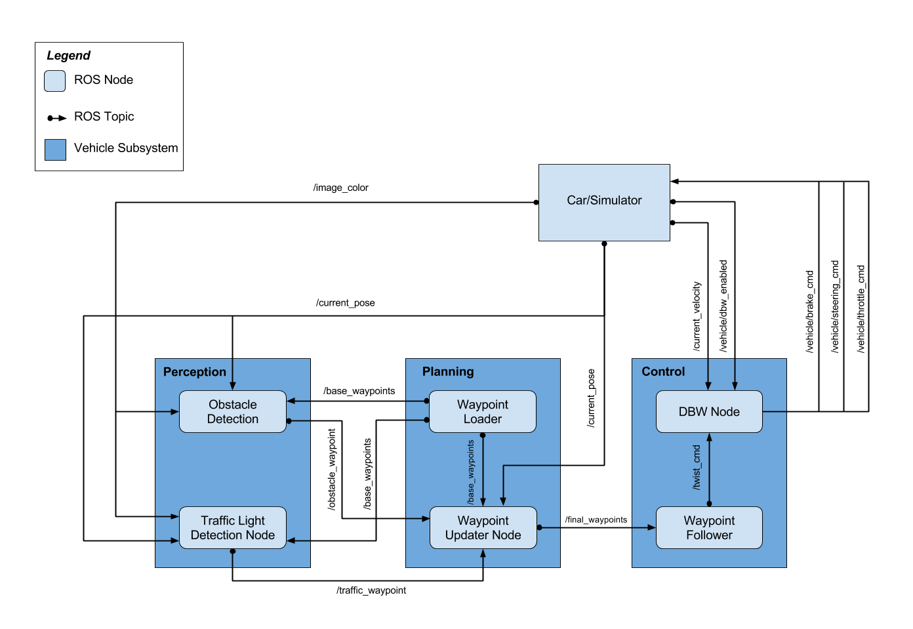
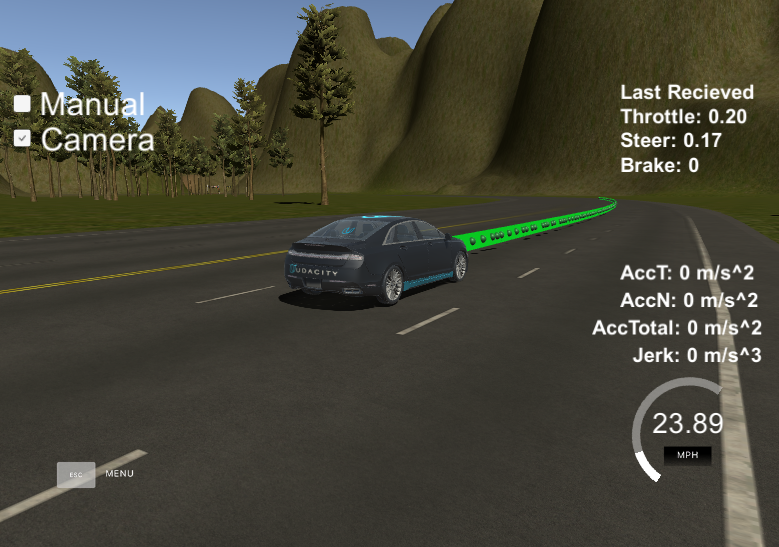

# **Capstone**
Self-Driving Car Engineer Nanodegree Program
   
## Project scope
The goal for this project is to program a real self-driving car. More specifically, we need to write ROS nodes to implement core functionality of an autonomous vehicle system, 
including traffic light detection, control, and waypoint following! We will test the code using a simulator that mimics the functionality on Carla (a real-life self driving car).

For more details on the setup and constraints, see the [original instructions](instructions.md)

## Writeup / README
The architecture for the system and most of the code is already provided, with some specific features defined for us to implement.



### Car control
As instructed in the video walkthroughs, I had to update [waypoint_updater.py](ros/src/waypoint_updater/waypoint_updater.py) to publish a list of 200 waypoints representing the trajectory the car should follow. We are provided information about the entire track, so we subscribe to the `/base_waypoints` and `/current_pose` topics to get all points and our current position.

```python
rospy.Subscriber('/current_pose', PoseStamped, self.pose_cb)
rospy.Subscriber('/base_waypoints', Lane, self.waypoints_cb)
```

Using the SciPy's [KDTree](https://docs.scipy.org/doc/scipy/reference/generated/scipy.spatial.KDTree.html) we search for the next 200 points ahead of as publish this information to the `/final_waypoints` topic. These are picked up by other ros nodes and can be seen in the simulator as floating green orbs.



Next I updated the [twist_controller](ros/src/twist_controller/dbw_node.py) to transform the previous trajectory into actual commands for the car's `steering`, `throttle` and `brake`. This means [getting car parameters](ros/src/twist_controller/dbw_node.py#L38) like vehicle mass, wheel radius, etc. and then subscribing to ros topics to get info about the current state of the car (`/current_velocity`) and target commands (`/twist_cmd`) like desired linear and angular velocities. The conversion from a list of waypoints to these *twist commands* is already handled for us.

The actual [controller](ros/src/twist_controller/twist_controller.py) of the car uses the provided
[yaw controller](ros/src/twist_controller/yaw_controller.py) to control the car's steering and a combination of [low pass filter](ros/src/twist_controller/lowpass.py) and [PID Controller](ros/src/twist_controller/pid.py) for controlling the throttle. The code is similar to the one in previous projects and the suggested values were quite good, so no extra calibration was needed here.

```python
yaw_controller = YawController(wheel_base=wheel_base, steer_ratio=steer_ratio, 
                                    min_speed=0.1, max_lat_accel=max_lat_accel
                                    max_steer_angle=max_steer_angle)
throttle_controller = PID(kp=0.3, ki=0.1, kd=0.0, mn=0.0, mx=0.2)
velocity_lp_filter = LowPassFilter(tau=0.5, ts=0.2)
```

The brake is then used to slow down the car and bring the car to a standstill
```python
if proposed_linear_velocity == 0.0 and current_linear_velocity < 0.1:  # we should stop the car
    throttle = 0
    brake = 700
elif throttle < 0.1 and velocity_error < 0:  # we should slow down
    throttle = 0
    deceleration = max(velocity_error, self.decel_limit)
    brake = abs(deceleration) * self.vehicle_mass * self.wheel_radius  # torque N*m
```
At this point the car can drive itself in the simulation. But since manual driving is also possible, the controller needs to be aware and release control (and reset PID states where needed). Fortunately this is made easy by following the `/vehicle/dbw_enabled` which provides a boolean flag indicating when "self-driving" is enabled.

### Traffic light detection

This is where I spent most of my time in this project. While we are provided with the position of all traffic lights, the traffic light classification is left as an optional exercise.

In a similar manner to computing the next waypoints, we go through the list of all traffic lights and pick the closest to us. This basically gives us a waypoint where we should in front of that light if needed. The same KDTree search is used and the next stopping point [is published](ros/src/tl_detector/tl_detector.py#L99) at `/traffic_waypoint`

In order to know if the next light is red or green, I subscribed to the `/image_color` to get raw pixels as see from the car's front camera. I then used a pre-trained tensorflow model to find traffic lights in the image.

Since tensorflow provides popular object detection models trained on popular datasets on it's [Model Zoo](https://github.com/tensorflow/models/blob/master/research/object_detection/g3doc/tf1_detection_zoo.md) I picked [SSD: Single Shot MultiBox Detector](https://arxiv.org/abs/1512.02325) with a [MobileNetv2](https://arxiv.org/abs/1801.04381) backbone for it's speed and small size. The nice thing about the model zoo is that those models are pre-trained on popular datasets like [COCO: Common Objects in Context](https://cocodataset.org/#overview) which includes a class for `traffic light`.
[Here](prepare_data.sh) I provided a script for downloading and unpacking the model that needs to be executed only once before starting the project.

The image is then [processed](ros/src/tl_detector/light_classification/tl_classifier.py) and if any traffic lights are found we get the one we are most confident about and classify it in `RED`/`GREEN`, which tells us if we need to stop at the next closest traffic light or not.
```python
# search for traffic light bounding boxes
boxes, scores, classes = self.sess.run([detection_boxes, detection_scores, detection_classes], feed_dict={image_tensor: np.expand_dims(converted, 0)})

confidence_cutoff = 0.2
# Filter boxes with a confidence score less than `confidence_cutoff`
boxes, scores, classes = self.filter_boxes(confidence_cutoff, boxes, scores, classes)

# The current box coordinates are normalized to a range between 0 and 1.
# This converts the coordinates actual location on the image.
(height, width, channels) = image.shape
box_coords = self.to_image_coords(boxes, height, width)

light = self.classify_lights(image, box_coords, classes)
```

For classifying a traffic light, I could have used a new model trained on images of red/green traffic lights but I could not find a pre-trained model nor an available dataset on which to train a model, so I went for a simple image processing approach. I crop the detected traffic light, split it in three parts vertically and by looking at individual RGB color channels I compare pixel counts for top-red vs bottom-green to decide the state of the traffic light:

```python
bot, left, top, right = box_coords[0, ...].astype(int)
crop = np.copy(image[bot:top, left:right])
# split in 3 parts vertically (a section for each light)
h = crop.shape[0]/3

# look at specific BGR channels
top_crop = crop[:h,:,2]
bottom_crop = crop[2*h:,:,1]
            
# count pixels in each area
red = np.sum(top_crop)
green = np.sum(bottom_crop)

if green > red:
    light = TrafficLight.GREEN
else:
    light = TrafficLight.RED
```

This simple approach seems to perform fine on both the simulation


and parking lot


